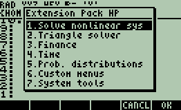

# Extension Pack HP

Extension Pack HP is a library developed in User RPL for HP 49 series calculators, including the HP 50g, HP 49g+, HP 49g, and HP 48GII. It brings features commonly found in other calculators, such as the HP 12c and modern Casio calculators, to the HP 49 series, helping to fill functional gaps left by the original firmware.



## Menus

- Solve nonlinear system
- Triangle solver
- Finance
  - Equivalent Interest Rate
  - Cash Flow
    - Internal Rate of Return (IRR)
    - Net Present Value (NPV)
    - Net Future Value (NFV)
    - Net Uniform Series (NUS)
  - Depreciation
    - Straight line (SL)
    - Sum-of-the-years digits (SOYD)
    - Declining balance (DB)
- Time
  - Date add/subtract
  - Date difference
- Probability Distributions
  - Discrete
    - Binomial
    - Poisson
    - Bernoulli
    - Uniform
    - Neg. Binomial
    - Geometric
    - Hipergeometric
  - Continuous
    - Normal
    - T-Student
    - Chi² (Pearson)
    - Exponential
    - Uniform
    - Gamma
    - Beta
    - Weibull
    - Cauchy-Lorentz
    - F-Distribution
  - Inverse
    - Binomial
    - Poisson
    - Normal
    - T-Student
    - Chi² (Pearson)
    - Exponential
    - Uniform (continuous)
    - Weibull
    - Cauchy-Lorentz
    - F-Distribution
- Custom menus
  - Equations
  - Matrix
  - Combinatorics
  - Finance
  - Complex
- System tools
  - Reset system flags
  - Purge all HOME files
  - Factory reset (Algebraic mode)
  - Factory reset (RPN mode)

### Other commands

Adds new global commands, allowing access from anywhere in the calculator:

- `EXTPK` - **Extension Pack HP Command Menu**: Opens a centralized menu that lists all features included in the Extension Pack HP, offering a quick and convenient way to access its tools.

- `RSALG` - **Factory Reset Command (Algebraic mode)**: Reinitializes the calculator by resetting system flags for optimal use in Algebraic mode, clears the stack, removes all files and directories from the HOME directory (excluding program files), and restores the default contents of the CASDIR directory. Objects stored in IRAM, ERAM, or FLASH memory remain unaffected.

- `RSRPN` - **Factory Reset Command (RPN mode)**: Reinitializes the calculator by resetting system flags for optimal use in RPN (Reverse Polish Notation) mode, clears the stack, removes all files and directories from the HOME directory (excluding program files), and restores the default contents of the CASDIR directory. Objects stored in IRAM, ERAM, or FLASH memory remain unaffected.

- `DSTAT` - **Descriptive Statistics Command**: Computes key descriptive statistics (such as mean, median, standard deviation, and more) for a given list or array.
```
Input:
 - Argument 1: list, array or matrix
```

- `XFRAC` - **Fraction Conversion Tool**: Converts numbers between decimal and rational (quotient) form, functioning similarly to the `ab/c` key on other calculators.
```
Input:
 - Argument 1: a number or a list/array/matrix of numbers
```

- `NSOLVE` - **Numerical Solver Command**: Calls the ROOT command using the predefined variable VX from the CASDIR directory. This command makes the process faster and more streamlined.
```
Input:
 - Argument 1: 'symb' or «program»
 - Argument 2: guess
```

* `ANGLV` - **Angle Between Vectors**: Computes the angle between two vectors using the dot product formula.

```
Input:
 - Argument 1: array A
 - Argument 2: array B
```

* `UNITV` - **Unit Vector Generator**: Returns the unit (normalized) vector in the direction of a given vector.

```
Input:
 - Argument 1: array or matrix
```

- `RECPOL` - **Rectangular/Polar Toggle Command**: Switches between Rectangular and Polar coordinate modes. If the calculator is currently set to Rectangular mode, it will switch to Cylindrical (Polar), and vice versa. Useful for quickly changing the coordinate system.

## Contributing

If you spot a bug or want to improve the code or even improve the content, you can do the following:

- [Open an issue](https://github.com/cfgnunes/extension-pack-hp/issues/new)
  describing the bug or feature idea;
- Fork the project, make changes, and submit a pull request.
