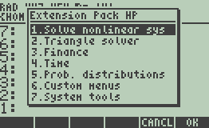

# Extension Pack HP

Extension Pack HP is a library developed in User RPL for HP 49 series calculators, including the HP 50g, HP 49g+, HP 49g, and HP 48GII. It brings features commonly found in other calculators, such as the HP 12c and modern Casio calculators, to the HP 49 series, helping to fill functional gaps left by the original firmware.

The library adds new features to the Finance, Time, and Statistics menus, including NPV, IRR, depreciation methods, probability distributions, and date operations. It also provides system tools, custom menus, and global commands for easier access and management.



## Features

### Numeric Solver Menu

Adds new applications to the Numeric Solver menu (keys: `Right Shift` → `7`) with:

- **Solve nonlinear system**
- **Triangle solver**

### Finance Menu

Adds new applications to the Finance menu (keys: `Left Shift` → `9`) with:

- **Net Present Value (NPV)**
- **Internal Rate of Return (IRR)**
- **Depreciation methods**
    - Straight line (SL)
    - Sum-of-the-years digits (SOYD)
    - Declining balance (DB)

### Time Menu

Adds new applications to the Time menu (keys: `Right Shift` → `9`) with:

- **Date add/subtract**
- **Date difference**

### Statistics Menu

Adds new applications to the Statistics menu (keys: `Right Shift` → `5`) with:
- **Probability Distributions**
    - Discrete: Binomial
    - Discrete: Poisson
    - Discrete: Bernoulli
    - Discrete: Uniform
    - Discrete: Neg. Binomial
    - Discrete: Geometric
    - Discrete: Hipergeometric
    - Continuous: Normal
    - Continuous: T-Student
    - Continuous: Chi² (Pearson)
    - Continuous: Exponential
    - Continuous: Uniform
    - Continuous: Gamma
    - Continuous: Beta
    - Continuous: Weibull
    - Continuous: Cauchy-Lorentz
    - Continuous: F-Distribution
    - Inverse: Binomial
    - Inverse: Poisson
    - Inverse: Normal
    - Inverse: T-Student
    - Inverse: Chi² (Pearson)
    - Inverse: Exponential
    - Inverse: Uniform (continuous)
    - Inverse: Weibull
    - Inverse: Cauchy-Lorentz
    - Inverse: F-Distribution
- **DSTAT**

### APPS Menu

Adds new features under the APPS menu (key: `APPS`) with:

- **Custom menus**
    - Equations
    - Matrix
    - Combinatorics
    - Finance
- **System tools**
    - Reset system flags
    - Reset system flags (RPN mode)
    - Purge all HOME files
    - Purge all files and reset system flags
    - Purge all files and reset system flags (RPN mode)

### Other commands

Adds new global commands, allowing access from anywhere in the calculator:

- `EXTPK` - **Extension Pack HP Command Menu**: Opens a centralized menu that lists all features included in the Extension Pack HP, offering a quick and convenient way to access its tools.

- `RSALG` - **Factory Reset Command (Algebraic mode)**: Reinitializes the calculator by resetting system flags for optimal use in Algebraic mode, clears the stack, removes all files and directories from the HOME directory (excluding program files), and restores the default contents of the CASDIR directory. Objects stored in IRAM, ERAM, or FLASH memory remain unaffected.

- `RSRPN` - **Factory Reset Command (RPN mode)**: Reinitializes the calculator by resetting system flags for optimal use in RPN (Reverse Polish Notation) mode, clears the stack, removes all files and directories from the HOME directory (excluding program files), and restores the default contents of the CASDIR directory. Objects stored in IRAM, ERAM, or FLASH memory remain unaffected.

- `XFRAC` - **Fraction Conversion Tool**: Converts numbers between decimal and rational (quotient) form, functioning similarly to the `ab/c` key on other calculators.
```
Input:
 - Argument 1: a number or a list/array/matrix of numbers
```

- `NSOLVE` - **Numerical Solver Command**: Calls the ROOT command using the predefined variable VX from the CASDIR directory. This command makes the process faster and more streamlined.
```
Input:
 - Argument 1: 'symb' or «program»
 - Argument 2: guess
```

- `DSTAT` - **Descriptive Statistics Command**: Computes key descriptive statistics (such as mean, median, standard deviation, and more) for a given list or array.
```
Input:
 - Argument 1: list, array or matrix
```

## Contributing

If you spot a bug or want to improve the code or even improve the content, you can do the following:

- [Open an issue](https://github.com/cfgnunes/extension-pack-hp/issues/new)
  describing the bug or feature idea;
- Fork the project, make changes, and submit a pull request.
